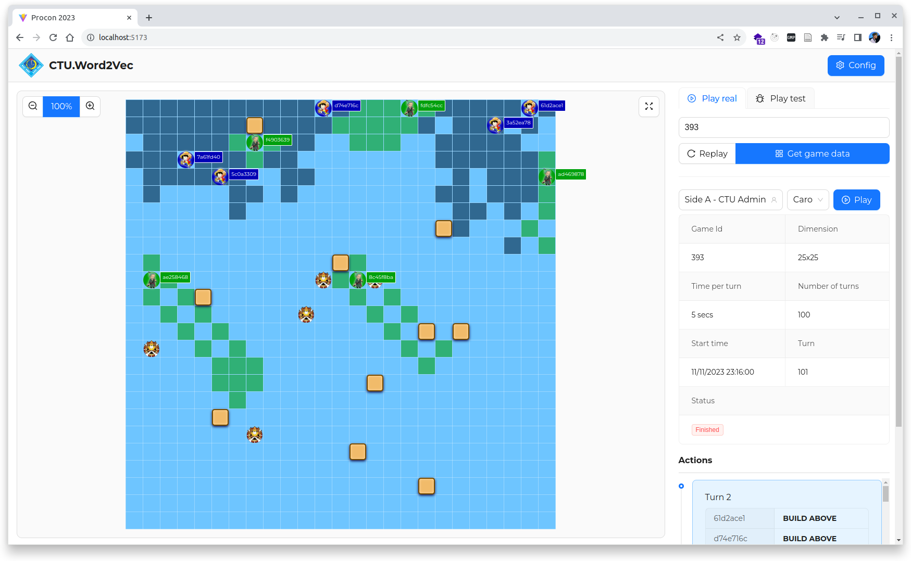
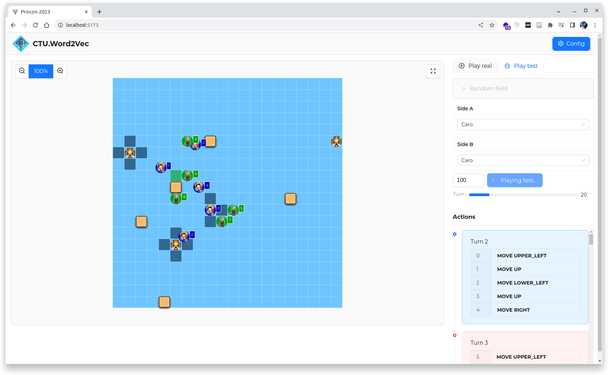

# CTU.Word2Vec Procon 2023

<p style="text-align: center">
    
</p>

Procon 2023: Castle game [Details](https://drive.google.com/file/d/1GjMPgYpT2FNNmtSztPiTp1mWqT46vZLC/view)

## Real mode



## Test mode



## How to run?

-   Copy file `.env.example` to file `.env.local` and config some below variables
    -   `VITE_APP_API_URL`: the api endpoint of the game server
-   Use docker compose to run game
    ```sh
    docker compose up -d
    ```
